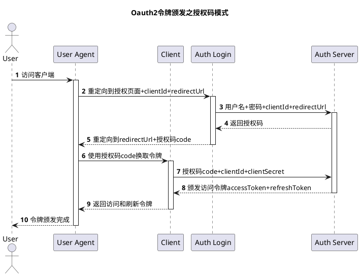
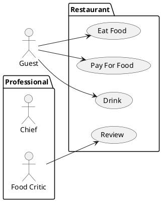
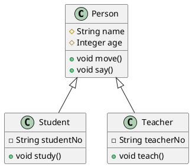
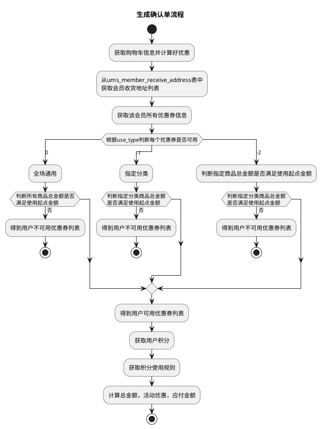
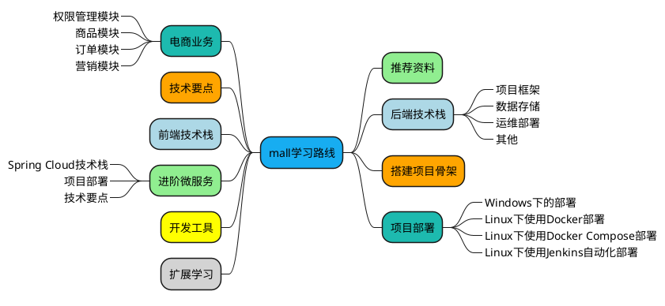

> 程序员在工作中，经常会有绘制时序图、流程图的需求，尤其是在写文档的时候。平时我们会选择ProcessOn这类工具来绘制，但有时候用代码来画图可能会更高效一点，毕竟没有比程序员更熟悉代码的了。今天给大家推荐一款画图工具PlantUML，可以配合IDEA使用，画图更高效！

SpringBoot实战电商项目mall（50k+star）地址：[github.com/macrozheng/…](https://link.juejin.cn?target=https%3A%2F%2Fgithub.com%2Fmacrozheng%2Fmall "https://github.com/macrozheng/mall")

PlantUML简介
----------

PlantUML是一款开源的UML图绘制工具，支持通过文本来生成图形，使用起来非常高效。可以支持时序图、类图、对象图、活动图、思维导图等图形的绘制。

下面使用PlantUML来绘制一张流程图，可以实时预览，速度也很快！

安装
--

> 通过在IDEA中安装插件来使用PlantUML无疑是最方便的，接下来我们来安装下IDEA的PlantUML插件。

*   首先在IDEA的插件市场中搜索`PlantUML`，安装这个排名第一的插件；

*   有时候网络不好的话可能下载不下来，可以点击`Plguin homepage`按钮访问插件主页，然后选择合适的版本下载压缩包；

*   下载成功后，选择从本地安装即可。

使用
--

> 接下来我们使用PlantUML插件分别绘制时序图、用例图、类图、活动图、思维导图，来体验下PlantUML是不是真的好用！

### 时序图

> 时序图（Sequence Diagram），是一种UML交互图。它通过描述对象之间发送消息的时间顺序显示多个对象之间的动态协作。我们在学习Oauth2的时候，第一步就是要搞懂Oauth2的流程，这时候有个时序图帮助可就大了。下面我们使用PlantUML来绘制Oauth2中使用授权码模式颁发令牌的时序图。

*   首先我们需要新建一个PlantUML文件，选择时序图；

*   我们可以通过PlantUML提供的语法来生成Oauth2的时序图，语法还是非常简单的，具体内容如下；

*   该代码将生成如下时序图，用写代码的方式来画时序图，是不是够炫酷；

*   本时序图关键说明如下：
    *   `title`可以用于指定UML图的标题；
    *   通过`actor`可以声明人形的参与者；
    *   通过`participant`可以声明普通类型的参与者；
    *   通过`as`可以给参与者取别名；
    *   通过`->`可以绘制参与者之间的关系，虚线箭头可以使用`-->`；
    *   在每个参与者关系后面，可以使用`:`给关系添加说明；
    *   通过`autonumber`我们可以给参与者关系自动添加序号；
    *   通过`activate`和`deactivate`可以指定参与者的生命线。
*   这里还有个比较神奇的功能，当我们右键时序图时，可以生成一个在线访问的链接；

*   直接访问这个链接，可以在线访问UML时序图，并进行编辑，是不是很酷！

### 用例图

> 用例图（Usecase Diagram）是用户与系统交互的最简表示形式，展现了用户和与他相关的用例之间的关系。通过用例图，我们可以很方便地表示出系统中各个角色与用例之间的关系，下面我们用PlantUML来画个用例图。

*   首先我们需要新建一个PlantUML文件，选择用例图，该用例图用于表示顾客、主厨、美食家与餐馆中各个用例之间的关系，具体内容如下；

*   该代码将生成如下用例图；

*   本用例图关键说明如下：
    *   `left to right direction`表示按从左到右的顺序绘制用例图，默认是从上到下；
    *   通过`package`可以对角色和用例进行分组；
    *   通过`actor`可以定义用户；
    *   通过`usecase`可以定义用例；
    *   角色和用例之间的关系可以使用`-->`来表示。

### 类图

> 类图（Class Diagram）可以表示类的静态结构，比如类中包含的属性和方法，还有类的继承结构。下面我们用PlantUML来画个类图。

*   首先我们需要新建一个PlantUML文件，选择类图，该图用于表示Person、Student、Teacher类的结构，具体内容如下；

*   该代码将生成如下类图，看下代码和类图，是不是发现和我们用代码定义类还挺像的；

*   本类图关键说明如下：
    *   通过`class`可以定义类；
    *   通过在属性和方法左边加符号可以定义可见性，`-`表示`private`，`#`表示`protected`，`+`表示`public`；
    *   通过`<|--`表示类之间的继承关系。

### 活动图

> 活动图（Activity Diagram）是我们用的比较多的UML图，经常用于表示业务流程，比如电商中的下单流程就可以用它来表示。下面我们用PlantUML来画个活动图。

*   首先我们需要新建一个PlantUML文件，选择活动图，这里使用了mall项目中购物车中生成确认单的流程，具体内容如下；

*   该代码将生成如下活动图，在活动图中我们既可以用`if else`，又可以使用`switch`，甚至还可以使用`while循环`，功能还是挺强大的；

*   本活动图关键说明如下：
    *   通过`start`和`stop`可以表示流程的开始和结束；
    *   通过`:`和`;`中间添加文字来定义活动流程节点；
    *   通过`if`+`then`+`endif`定义条件判断；
    *   通过`switch`+`case`+`endswitch`定义switch判断。

### 思维导图

> 思维导图（Mind Map），是表达发散性思维的有效图形工具，它简单却又很有效，是一种实用性的思维工具。之前在我的mall学习教程中就有很多地方用到了，下面我们用PlantUML来画个思维导图。

*   首先我们需要新建一个PlantUML文件，选择思维导图，这里使用了mall学习路线中的大纲视图，具体内容如下；

*   该代码将生成如下思维导图，其实使用PlantUML我们可以自己定义图形的样式，这里我自定义了下颜色；

*   本思维导图关键说明如下：
    *   通过`+`和`-`可以表示思维导图中的节点，具有方向性；
    *   通过`[#颜色]`可以定义节点的边框颜色；
    *   通过`_`可以去除节点的边框；

总结
--

虽然目前可以绘制UML图的图形化工具很多，但是对于程序员来说，使用代码来绘图可能更直接，效率更高，尤其是配合IDEA使用。如果你想使用代码来绘图，不妨尝试下PlantUML吧。

参考资料
----

官方文档：[plantuml.com/zh/](https://link.juejin.cn?target=https%3A%2F%2Fplantuml.com%2Fzh%2F "https://plantuml.com/zh/")

> 本文 GitHub [github.com/macrozheng/…](https://link.juejin.cn?target=https%3A%2F%2Fgithub.com%2Fmacrozheng%2Fmall-learning "https://github.com/macrozheng/mall-learning") 已经收录，欢迎大家Star！